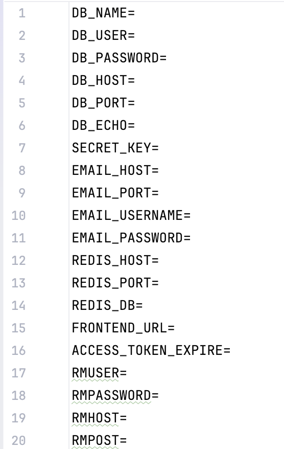

# MemoSpace — Backend API для заметок

## 📌 Описание проекта

MemoSpace — веб-приложение для управления заметками пользователей.  
Проект разработан как backend-сервис с REST API, позволяющий пользователям создавать, редактировать и удалять заметки, а также хранить их в базе данных с разграничением доступа.

Реализована регистрация и авторизация пользователей с использованием JWT, а также защита данных и бизнес-логика на сервере.

---

## 🚀 Функциональность

- Регистрация и авторизация пользователей (JWT)  
- Разграничение доступа к заметкам: каждый пользователь видит только свои заметки  
- Создание, редактирование, удаление заметок  
- Асинхронное взаимодействие клиента с сервером (AJAX)  
- Валидация пользовательских данных на сервере  
- Хранение данных в реляционной базе данных (MySQL)  
- Миграции базы данных с помощью Alembic  
- Покрытие ключевой бизнес-логики модульными тестами (Pytest)

---

## 🏗 Архитектура проекта

- **Backend:** FastAPI  
- **ORM:** SQLAlchemy  
- **База данных:** MySQL  
- **Аутентификация:** JWT  
- **Тестирование:** Pytest  
- **Асинхронность:** aiohttp / asyncio для обработки запросов  

---

## 🛠 Используемые технологии

- Python  
- FastAPI  
- SQLAlchemy  
- MySQL  
- JWT  
- Alembic  
- Pytest  
- HTML, CSS, JavaScript, jQuery (для асинхронного взаимодействия)  

---

## ⚙️ Установка и запуск

### 1. Клонирование репозитория
```bash
git clone https://github.com/AlexGitHub21/MemoSpace.git
cd MemoSpace

### 2. Установка зависимостей
pip install -r requirements.txt

### 3. Настройка базы данных
Создать базу данных MySQL
Настроить параметры подключения к БД, указать порт, хост почты/redis в файле .env в корне проекта


### 4. Запуск приложения
В корне проекта прописать команду:
uvicorn apps.main:app --reload

### 5. Открыть Swagger UI
http://127.0.0.1:8000/docs

### 6. consumer запускаем отдельно
В корне проекта прописываем команду python -m rabbitmq.pdf_consumer

### 7. Настроить RabbitMQ
Ссылка на Habr: https://habr.com/ru/companies/slurm/articles/704208/
В папке docker создаю docker-compose.yml

### 8. Запустить веб-интерфейс RabbitMQ 
docker-compose up в папке docker

### 9. Остановить веб-интерфейс 
docker-compose down в папке docker

### 10. Действия с заметками
Действия с заметками доступны только авторизованному пользователю. 
Необходиимо пройти регистрацию, подтвердить почту, авторизоваться и тогда работать с заметками (через Swagger UI)

